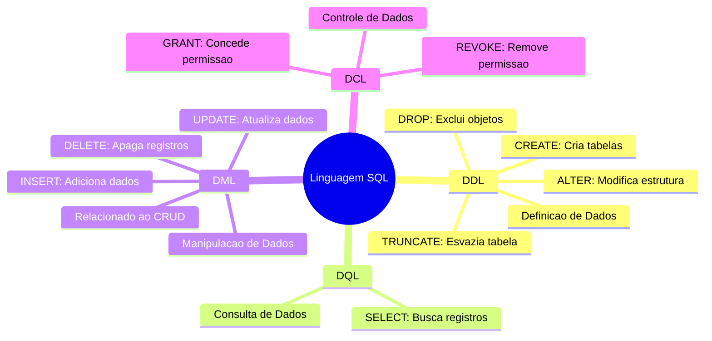

## SQL

- Linguagem de Consulta a Banco de dados. Voltada para manipulação de dados. 

Abaixo citaremos os principais subgrupos de comandos dentro do SQL.
- DDL: Data Definition Language - Comandos usados para criar, alterar ou excluir a `estrutura` de objetos no banco de dados. `CREATE` `ALTER` `DROP` `TRUNCATE`.
  
- DML: Data Manipulation Language - Diferente do DDL, que manipula a estrutura o DML manipula o dado. Ou seja os comandos do DML é diretamente ligado aos dados. `INSERT` `UPDATE` `Delete`. (Dentro do CRUD, refere-se ao C, U e D)
  
- DCL: Data Control Language - Comandos para gerenciar acessos ao banco de dados. Exemplo: Permitir que um usuário possa ler. `GRANT` (Garantir o acesso) e `REVOKE` Revoga o acesso.
  
- DQL: Data Query Language - Comandos que buscam e recupera os dados de um banco de dados - `SELECT` Comando principal.
  
 
---
 
 
 
 

<h1> Diagrama SQL
 
 

---

