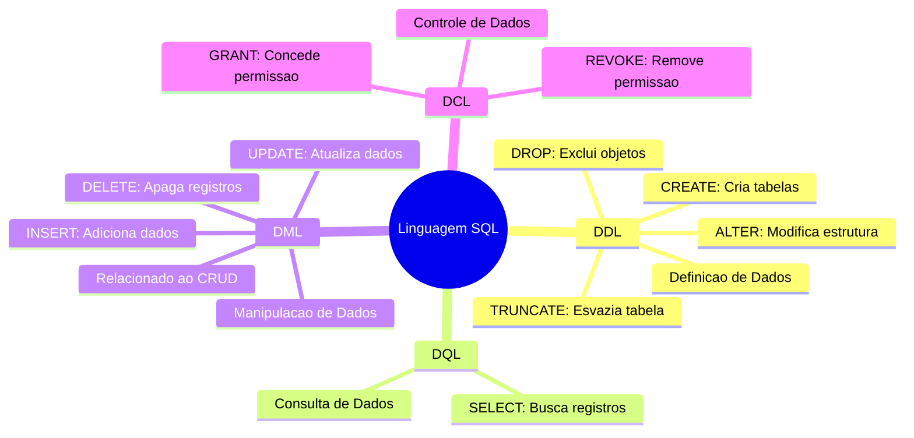

## SQL

- Linguagem de Consulta a Banco de dados. Voltada para manipulação de dados. 

Abaixo citaremos os principais subgrupos de comandos dentro do SQL.
- DDL: Data Definition Language - Comandos usados para criar, alterar ou excluir a `estrutura` de objetos no banco de dados. `CREATE` `ALTER` `DROP` `TRUNCATE`.
<br><br/>
- DML: Data Manipulation Language - Diferente do DDL, que manipula a estrutura o DML manipula o dado. Ou seja os comandos do DML é diretamente ligado aos dados. `INSERT` `UPDATE` `Delete`. (Dentro do CRUD, refere-se ao C, U e D)
<br><br/>
- DCL: Data Control Language - Comandos para gerenciar acessos ao banco de dados. Exemplo: Permitir que um usuário possa ler. `GRANT` (Garantir o acesso) e `REVOKE` Revoga o acesso.
<br><br/>
- DQL: Data Query Language - Comandos que buscam e recupera os dados de um banco de dados - `SELECT` Comando principal.
<br><br/>
<br><br/>
---

<br>


<h1> Diagrama SQL
<br><br/>

---


---
<br/><br/>

# Dbreaver e MySQL

- Dbreaver - Ferramenta que auxilia na visualização dos dados. Segue a mesma premissa de ferramentas SQL, auxiliando na visualização e na prática.

- Dbreaver - Permite utilizar Sample, que é um banco de dados para testes, ao invés te testar com banco de dados em prod, ele permite utilizar comandos SQL para práticar.

Nesta prática, notei que há alguns padrões no SQL, quando pensamos em algoritmo seguimos sempre uma lógica, no SQL segue uma lógica de funilamento. Seguindo essa estrutura:

```SQL
SELECT  -- SELECIONA AS COLUNAS, E REALIZA A CONTAGEM.
  a.Title, 
  a.ArtistId, 
  a2.Name, 
  COUNT(a.ArtistID) over() AS Total  -
FROM Album a --- Minha Tabela Album definindo o nome de A
INNER JOIN Artist a2 ON a.ArtistId = a2.ArtistId  --- Unindo a exibição juntamente com a tabela de artista, agrupando onde os IDs se repetem
WHERE a2.Name = 'Deep Purple' --- Filtro para a tabela
```


#### OBSERVAÇÕES:

1° - ``GROUP BY`` É nesse comando que mostra o nivel de granulidade, ou seja, o quanto você irá mostrar, no caso do exemplo acima, ele resume tudo a uma linha.

2° ``SELECT`` 'SELECT *' Seleciona tudo.

3° ``OVER()`` Comando, para exibir a contagem em todas linhas, sem ele o SQL resume a resposta para somente uma linha

4° ``ON`` Fundamental esse comando, pois antes mesmo de começar a busca, o processamento da resposta já vem organizado, pensando em escalabilidade, é fundamental entender esse principio.

5° ``LIMIT`` Como o próprio nome sugere, limita a quantidade de linhas informadas 

6° ``GROUP BY`` Embora, alguns professores ensinam o comando, GROUP BY 1, indicando para agrupar pela coluna 1, não é indicado pois, se dado algum momento a coluna mude de posição, haverá problemas no script.